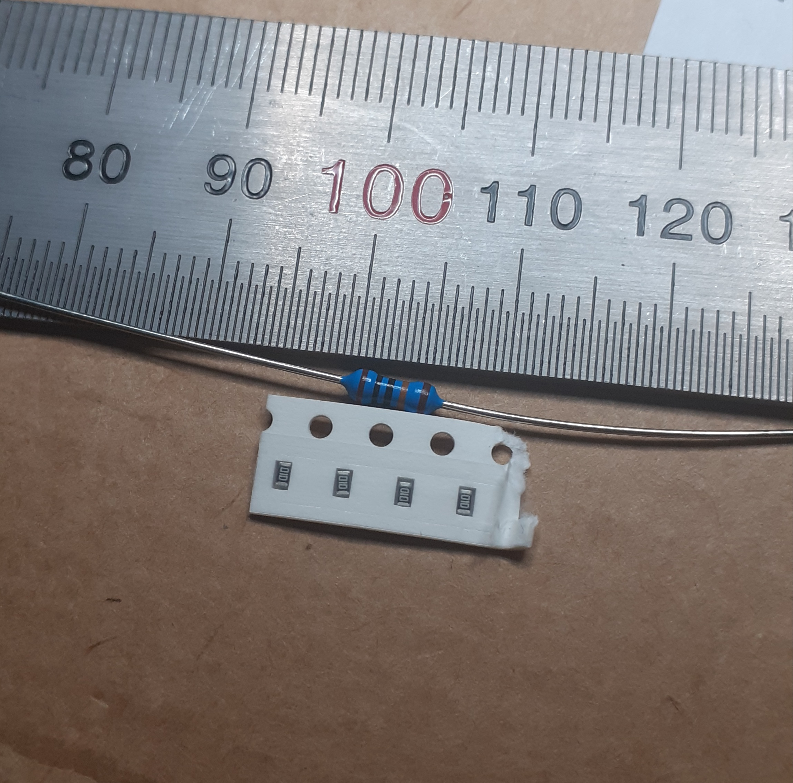
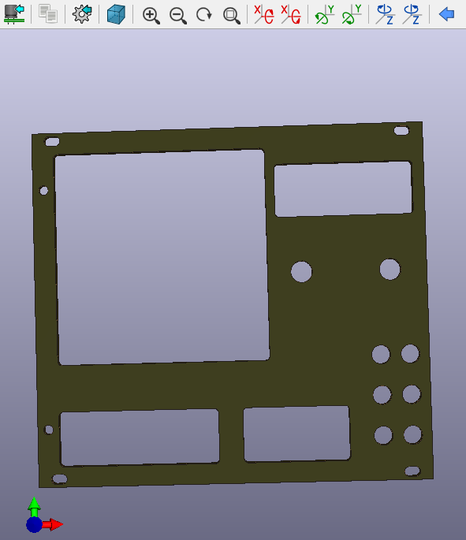

**Tämä on vielä keskeneräinen opinnäytetyö**, mutta voit lueskella sitä jo rullaamalla alaspäin.

_KISSen testailua_

# Opinnäytetyö (Eurorack-syntetisaattorin sekvensserin kehitys ja tekninen monistaminen)

Elmo Rohula

Haaga-Helia ammattikorkeakoulu

7.3.2021

## Tiivistelmä

**Tekijä(t)**

  * Elmo Rohula

**Koulutusohjelma**

  * Tietojenkäsittely

**Raportin/Opinnäytetyön nimi**

  * Eurorack-syntetisaattorin sekvensserin kehitys ja tekninen monistaminen

**Tiivistelmä**

Opinnäytetyö keskittyy sulautetun järjestelmän luomiseen Arduino-kehitysalustalle sopivilla työkaluilla. Luodun sulautetun järjestelmän prototyyppi tullaan saattamaan valmiiksi teknistä monistamista varten. Teknistä monistamista varten laitteelle tullaan luomaan piirilevypiirustukset, piirustukset mahdollisesti tarvittavasta etupaneelista, sekä kustannusarvioit projektin viemisestä sarjatuotantoon.

Luotu laite tulee olemaan sekvensseri Eurorack-syntetisaattoreille.

Laitteen luominen tullaan käymään läpi tarkemmin tarkastelemalla tarvittavia teknologioita, työkaluja, sekä laitteen lähdekoodia ja toimintaa. Laitteen luomisen prosessi käsittää sisälleen kaiken alkuperäisestä ideasta aina valmiin piirilevyn luomiseen komponentteineen.

Projektin monistamisen prosessi tullaan käymään läpi samalla tavalla kuin itse laitteen luomisen prosessi. Tekninen monistaminen pitää sisällään mm. prototyypin lopullisten komponenttien päättämisen, sarjatuotannon kustannusten arvioimisen, sekä lopullisen rakennusprosessin ajoittamisen sarjatuotannon kustannuksiin laskemista varten.

Lopussa arvioidaan itse projektin onnistumista, sekä monistamisprosessin hyödyllisyyttä vastaavien projektien näkökulmasta.

**Asiasanat**

Eurorack, Arduino, sulautettu järjestelmä, monistaminen, c++, sekvensseri

## 1. Johdanto

  // tekstiä

**1.1 Tavoitteet ja rajaus**

Opinnäytetyön tavoitteena on selkeyttää teknisen monistamisen prosessia. Opinnäytetyön aikana luotu Eurorack-sekvensseri toimii tämän teknisen monistamisen kohteena. Näihin tavoitteisiin pääsemiseen vaaditaan myös itse laitteen luominen, joten valmis laite, tai ainakin sen pitkälle viety prototyyppi syntyy myös projektin aikana.

  // Päätä alle julkaisun lisenssi!!!!

Laitteen kehittämisestä syntyvä dokumentaatio, lähdekoodi, sekä kytkentäkaaviot tullaan julkaisemaan GitHubissa.

Valmiita opinnäytetöitä sulautettujen järjestelmien luomisesta löytyy useita, mutta harvassa ollaan edes mietitty niiden tuotoksien monistamista, taikka viemistä kevyestä prototyypistä eteenpäin. Tämän opinnäytetyön teknisen monistamisen prosessin kuvaaminen ja läpikäynti tulisi auttamaan muiden vastaavien projektien viemisessä eteenpäin kohti sarjatuotantoa. Vaikka tämän opinnäytetyön puitteissa keskitytään hyvin spesifiin laitteeseen, sekä suhteellisen suureen teoreettiseen tuotantomäärään teknisen monistamisen osuudessa, pystyisi vastaavilla prosesseilla ja työkaluilla luomaan pienemmän mittakaavan sarjatuotantoa harrastus-, koulu-, tai yritysprojekteihin.

Tekninen monistaminen tämän opinnäytetyön puitteissa keskittyy yhden tai muutaman valmiin laitteen rakennukseen, rakennuksen keston ajoittamiseen kustannusarvioita varten, sekä sarjatuotannon kustannuksien arviointiin. Näistä eri kustannusarvioista saadaan laitekohtainen hinta, kun arvoidaan teknisen monistamisen tuloksia.

Opinnäytetyön teknisen monistamisen prosessi ei pidä sisällään monistettavan laitteen tuotteeksi viemistä. Vaikka monistamisprosessista syntyy kustannusarvioita, ovat nämä pelkästään arvioita laitteen sarjatuotannosta. Tuotteistamista varten tulisi tehdä selvitys kilpailijoista, markkinoista, sekä selvitys siitä, olisiko kukaan todellisuudessa valmis ostamaan mahdollisesti valmistuvaa tuotetta.

**1.2 Käsitteet**

  // Etsi näille myös lähteitä.

  * Arduino - Avoimen lähdekoodin alusta elektroniikka projektien kehitykseen [(Arduino)](https://www.arduino.cc/en/Guide/Introduction).
  * Teensy - Arduinon kaltainen, elektroniikka projektien kehitysalusta [(pjrc)](https://www.pjrc.com/teensy/).
  * Eurorack - De-facto standardi pienikokoisille modulaarisille syntetisaattoreille [(Nora Codes - Modular Synthesis and UNIX)](https://nora.codes/post/modular-synthesis-and-unix/).
  * CV (Control Voltage) - Ohjausjännite, jolla voidaan ohjata analogisten syntetisaattoreiden eri osia.
  * Gate - 
  * Oskillaattori - 
  * Sekvensseri - Musiikin tuotannossa käytetty ylensä elektroninen laite tai ohjelmisto, jonka avulla voidaan toistaa, muokata ja soittaa musikaalisia sekvenssejä.
  * Step - Askel. Sekvenssereissä käytetty määre, jolla mitataan sekvenssin pituutta.
  * DAC (Digital to Analog Converter) - Mikropiiri, joka muuttaa sille annetun digitaalisen signaalin analogiseksi jännitteeksi. (Tähän lähde)
  * SPI (Serial Peripheral Interface) - Tietoteknisten järjestelmiän käyttämä väylä, jonka avulla kokonaisen laitteen eri komponentit keskustelevat keskenään. (Etsi tähän lähde)
  * PCB (Printed Circuit Board) - Piirilevy.
  * DFM (Design For Manufacturability) - /*Tarvitaanko tätä?*/ Tuotekehityksen prosessi, jossa tuottetta optimoidaan tuotannon prosesseja varten. [d4m](http://www.design4manufacturability.com/DFM_article.htm)

## 2. Taustaa

  Tämän luvun tarkoituksena on avata opinnäytetyön taustoja liittyen luotuun Eurorack-sekvensseriin, tekniseen monistamiseen, sekä erinäisiin kehitysmenetelmiin joita laitteen kehittämisessä tarvitaan. 
  // Tähän ehdottomasti vähän enemmän tekstiä.

**2.1 Eurorack**

Eurorack-syntetisaattori formaatti on Dieter Doepferin vuonna 1996 kehittämä formaatti modulaariselle syntetisaattorille [(reverb)](https://reverb.com/news/beginners-guide-to-eurorack-case-basics-oscillators-filters). Eurorack formaatille olennaisia piirteitä ovat sen pienikokoisuus muihin modulaarisiin syntetisaattoriformaatteihin verrattuna. Eurorack-syntetisaattorissa moduulien korkeus on noin kolme räkkiyksikköä (tai 128,5mm). Laskennallisesti korkeuden tulisi olla 133,4mm, mutta moduuleitten korkeudessa ollaan otettu huomioon kiinnityskiskojen "lippa". [(doepfer).](http://www.doepfer.de/a100_man/a100m_e.htm) Alunperin Eurorack-formaatti oli yhteensopiva 19 tuuman räkki standardin kanssa, mutta vuosien varrella erinäiset valmistajat, sekä Doepfer itse ovat valmistaneet standardia leveämpiä ja kapeampia koteloita.

Eurorack-syntetisaattorit, sekä modulaariset syntetisaattorit yleisesti eivät sisällä koskettimistoa ja harvoin koskettimiston integroiminen modulaariseen syntetisaattoriin on mahdollista. Eurorack-syntetisaattorin eri moduuleita ohjataan käyttäen erinäisiä ohjausjännitteitä (Control Voltage/CV) [(doepfer)](http://www.doepfer.de/a100_man/a100t_e.htm). Ohjausjännite on analoginen signaali, joka syötetään yhteen tai useampaan moduliin, joka tuottaa muutoksen syntetisaattorin signaaliketjussa suhteutettuna ohjausjännitteen määrään. Esimerkiksi oskillaattorin sävelkorkeuden nostaminen yhdellä oktaavilla vastaa yhden voltin korotusta ohjausjännitteessä 1V/Oct-standardilla [(learningmodular)](https://learningmodular.com/glossary/1-voct/).

Eurorack-syntetisaattoreita on myös mahdollista ohjata ulkopuolisilla laitteistoilla, sekä ohjelmistoilla, mutta näiden lähettämät signaalit muutetaan aina analogiseen muotoon.

  // Esimerkkejä järjestelmistä.

**2.2 Sulautettu järjestelmä**

Sulautettu järjestelmä on digitalisoitu järjestelmä, jonka toiminta on suppeampaa kuin tavallisen tietokoneen. Sulautettu järjestelmä on vain tiettyä tarkoitusta varten luotu järjestelmä. Sulautetuille järjestelmille on myös tyypillistä laskentaresurssien niukkuus, sekä suppea tuki ulkoisille laitteille. (Elicia White, Making Embedded Systems, chapter 1, etsi sivu myöhemmin.)

Tämän opinnäytetyön aikana valmistuva sekvensseri on myös sulautettu järjestelmä. Laite itsessään ei pidä sisällään mitään käyttöjärjestelmää ja sen ensisijainen tarkoitus on toimia Eurorack-syntetisaattorin sekvensserinä.

**2.3 Tekninen monistaminen**

  // Listaa tänne oppareita/julkaisuja, joissa prototyyppi/valmis laite ei koskaan joudu teknisen monistamisen kohteeksi.

Tekninen monistaminen tämän opinnäytetyön puitteissa tarkoittaa opinnäytetyön aikana valmistuvan laitteen laitteen prototyypin kehittämistä siihen tilaan, että käsityötä vaativat prosessit ovat minimoitu ja suuri osa työstä saatettu automatisoitavaan tilaan. Laitteen prototyyppivaiheessa rakennus vaatii paljon komponenttien asettelua ja kolvaamista käsin.

Tekninen monistaminen voidaan nähdä osana "rapid prototyping" teknologioita. "Rapid prototyping" teknologiat sekä prosessit ovat teollisuudessa käytettyjä prosesseja, joilla pyritään nopeuttamaan tuotteiden ja prototyyppien valmistusta. Näihin teknologioihin kuuluu esimerkiksi 3D-tulostus (Kai, C. C., & Fai, L. K. (1997). Rapid Prototyping. _Nanyang technological university_). Esimerkiksi opinnäytetyön laitteen piirilevyt piirretään CAD-ohjelmistolla, jonka jälkeen piirilevyt tilataan niitä valmistavalta tehtaalta. Tällä prosessilla vältyytään piirilevyjen valmistamiselta itse ja lopputuloksena ovat yhdenmukaiset piirilevyt.

Valmistuvan laitteen teknisesti monistettava muoto ei tulisi sisältämään kuin pakollisen määrän komponentteja, jotka vaativat ihmisen niiden asennukseen. Esimerkiksi laitteen piirilevyjen valmistuksen aikana olisi mahdollista myös juottaa suuri osa komponenteista tehtaalla, jos laite rakentuisi pintaliitoskomponenteista.

**2.4 Projektin rakenne ja prosessit**

Opinnäytetyön projekti prototyypistä teknisesti monistettavaan laitteeseen on melko laaja. Projektin prosessi on osittain kuvattuna projektisuunnitelmassa liitteessä 1, "Projektin tehtävät, työmäärät ja ajoitus". Projektin tehtävistä ei kuitenkaan suoranaisestä käy ilmi laitteen rakennuksen prosessi alusta loppuun. Prosessi kulkisi pääpiirteittäin seuraavasti:

  * Laitteen suunnittelu. Mietitään mahdollisesti käytettävät teknologiat ja käydään läpi aiemmin tuotettuja vastaavanlaisia projekteja/laitteita.
  * Prototyypin rakentamisen aloittaminen. Aloitetaan muutamalla keskeisellä ominaisuudella laitteen toiminnan kannalta ja rakennetaan muita ominaisuuksia siihen päälle.
  * Kaikkien yksittäisten ominaisuuksien kokeilu prototyypin aikana. Tässä vaiheessa kaikki lopulliselta laitteelta vaaditut tai toivotut ominaisuudet ovat käyty läpi.
  * Laitteen käyttöliittymän suunnittelu. Kokeillaan eri keinoilla mahdollisesti sopivaa käyttöliittymän muotoa.
  * Piirilevyjen ja etupaanelien suunnittelu, piirtäminen ja tilaus. Tässä vaiheessa prototyypin aikana syntyneet piirit käännetään piirilevylle luotujen kytkentäkaavojen mukaan. Myös etupaneeli hahmotellan piirilevyn, sekä aiemmin suunniteltujen toimintojen mukaan.
  * Komponenttien listaus, sekä tilaus. Prototyypin aikana käytetyt komponentit listataan ja tästä listauksesta luodaan projektille "Bill of Materials", jonka avulla komponentteja on mahdollista tilata yhteen tai useampaan vastaavaan laitteeseen.
  * Laitteen rakentaminen. Tässä vaiheessa rakennetaan yksi tai useampi teknisesti monistettava laite ja ajoitetaan rakennus lopullisia laskelmia varten.
  * Laskelmien teko ja tulosten läpikäynti. Tässä vaiheessa lasketaan laitteen rakennuksen ja suunnittelun kulut, sekä näiden perusteella tehdään laskelmia mahdollista sarjatuotantoa varten. Projektin tuloksia käydään myös läpi niiltä osin kun ne ovat merkittäviä.

## x Tutkimuksen tavoite ja hyödyt (viilaa vielä otsikkoa)

Tässä opinnäytetyössä haluan tarkastella jo kirjoitettujen opinnäytetöiden, sekä artikkelien pohjalta teknistä monistamista. Prototyyppien rakennusta käsitteleviä opinnäytetöitä on monia, mutta harvoissa mietitään prototyypin viemistä monistettavaan muotoon.

Julkaistuista opinnäytetöistä ja artikkeleista katsotaan kuinka kirjoittajat ovat luoneet toimivan prototyypin, mutta jättäneet avoimeksi laitteen jatkokehityksen. Näiden töiden myötä annan myös ehdotuksia ja ideoita siitä, kuinka laitteita oltaisiin voitu viedä teknisesti monistettavampaan muotoon.

Opinnäytetyön tuloksista alasta kiinnostuneet harrastajat, opiskelijat ja ehkä jopa ammattilaiset saavat yleisen kuvan siitä, mitä sulautetun järjestelmän prototyypin luominen vaatii. Tämän lisäksi opinnäytetyön tavoitteena on antaa yleistä kuvaa prosesseista, joilla luotu prototyyppi voitaisiin muokata teknisesti monistettavaan muotoon.

**x.1 Esimerkkityö 1 (Arduino-pohjainen laite liikkeen ja lämpötilan monitorointiin)**

  // Aleksi Karppila - Arduino-pohjainen laite liikkeen ja lämpötilan monitorointiin (2014)

Aleksi Karppilan opinnäytetyö "Arduino-pohjainen laite liikkeen ja lämpötilan monitorointiin" (2014) käsittelee Arduino-pohjaisen monitorointilaitteen rakentamista (viittaa tiivistelmään, 2014). Projektin aikana Karppila rakentaa toimivan laitteen, käy läpi sen toimintaa, ohjelmointia, sekä yleisiä käsitteitä Arduino-kehitysalustaan liittyen.

Karpilla kertoo valmistuksessa ja suunnittelussa pyrkineensä yksinkertaisuuteen, jotta laitteen toiminta olisi moitteetonta ja luodulla laitteella olisi mahdollisimman laaja kohderyhmä (viittaa sivu 13, 2014). Kuitenkin lopullinen laite, jota opinnäytetyössä on kuvattu muistuttaa pitkälti prototyypinomaista laitetta, jossa kytkennät ovat tehty hyppylangoilla korkytkentälaudan kautta. (Tähän vaikka kuva siitä opparista, laitteesta siis :---))

Jotta Karppilan laite saavuttaisi halutun laajan kohderyhmänsä tulisi laitteen kytkentöjen olla pysyviä ja laitteen eri komponenttien osana yhtä kokonaisuutta. Karppilan laitteen kohderyhmää rajoittaa näin ollen se, että laitetta tulisi harkitsemaan vain ne, joilla olisi osaamista ja halukkuutta rakentaa käsin Arduino-kehitysalustalle oma laitteensa.

Laitetta ei välttämättä olisi tarvinnut koota täysin omaksi kokonaisuudekseen, vaan Arduino-alustan komponenteista oltaisiin voitu rakentaa "Arduino-kilpi". Arduino-kilvet ovat valmiita laitekokonaisuuksia, jotka voidaan kytkeä suoraan Arduino-kehitysalustaan [(Arduino - arduino shields)](https://www.arduino.cc/en/Main/arduinoShields). Laitteen käyttäjän olisi vielä kuitenkin tarvinnut ohjelmoida laite.

  // Viittaa täällä vielä konkreettisiin prosesseihin, joita Karppila olisi voinut tehdä (Kicad, kytkentäkaavat jne.) Viittaa tähän opinnäytetyön ja projektin rakennusvaiheisiin

**x.2 Esimerkkityö 2**

  // Tähän esimerkkityö 2
  // Käy läpi samalla tavalla kuin ylemmässä kohdassa.
  // Etsi jokin samantyylinen, mutta sellainen työ, joka on käynyt projektissa eri työvaiheita kuin Karppilan työ

## x Sekvensserin prototyypin rakentaminen

  // Tässä luvussa käsitellään sekvensserin prototyypin rakentamista

Sekvensserin prototyypin rakennus tapahtui asteittain ja jokaista laitteen osaa ja toiminnallisuutta pyrittiin testaamaan yksitellen, sekä osana suurempaa kokonaisuutta. Laitteen pohjana ja inspiraationa toimi pitkälti Matthew Cieplakin "Super Sixteen"-sekvensseri.

Rakennuksessa käytettiin pelkästään koekytkentälautaa projektin alussa, mutta projektin edetessä ja komponenttien määrän kasvaessa joitain laitteen osia jouduttiin rakentamaan omiksi irrallisiksi kokonaisuuksiksiin.

**x.1 Ohjelmisto**

  // Ohjelmakoodin läpikäyntiä tärkeimmiltä komponenteilta. Kerro myös menetelmistä ja työkaluista (VSCode, PlatformIO, Teensy LC)

Laitteen lähdekoodi kirjoitettiin C++-ohjelmointikielellä Arduino koodipohjalle. Kehitysympäristönä toimi PlatformIO, joka on Arduino-yhteensopiva integroitu kehitysympäristö Visual Studio Codelle [(PlatformIO)](https://docs.platformio.org/en/latest/what-is-platformio.html). Kehitysalustana laitteessa toimii Teensy LC. Lopullisen laitteen on suunniteltu käyttävän ATmega328 mikroprosessoria, mutta kehityksen aikana Teensy LC oli pienemmän koonsa takia parempi vaihtoehto kuin esimerkiksi Arduino Uno.

**x.1.1 Käyttäjän syötteet**

Sekvensserin toiminnan kannalta muutamia käyttäjän syötteitä pitäisi pystyä lukemaan. Laitteen suunnitteluvaiheessa 16 painikkeen painikematriisi tulisi vastaamaan sekvenssin askeleen valinnasta, sekä funktiopainikkeen kanssa käytettynä erinäisistä funktioista. Käyttäjän tulisi myös pystyä muokkaamaan liukuvia arvoja, kuten sekvenssin askeleiden nuottien korkeutta, tempoa, sekä erinäisiä asetuksia, jotka vaikuttavat sekvensserin toimintaan. Liukuvien arvojen muokkaamiseen laite käyttää 24 askeleen enkooderia. Laitteessa on myös potentiometri, jolla käyttäjä voi säätä nuottien välistä liukumaa.

Painikematriisia luetaan MCP23S17 GPIO-laajentimen kanssa. Laitteella voidaan SPI-väylän välityksellä käyttää maksimissaan 16 GPIO-lisäpinniä [(TI - MCP23S17, sivu 1)](https://ww1.microchip.com/downloads/en/devicedoc/20001952c.pdf). Koska MCP23S17 vaatii onnistuneeseen tiedon välitykseen yhteensä 4 GPIO-pinniä mikroprosessorista saadaan MCP23S17:ta käyttämällä laajennettua mikroprosessorin GPIO-pinnien määrää 12:sta.

_Painikematriisin skannausta prototyyppi-vaiheessa MCP23S17:n avulla._

Resurssien säästämiseksi laitteen jokaisella funktiolla ei ole erillistä painiketta. Laitteesta löytyisi "funktio"-painike, jota painettaessa käyttäjä voisi käyttää laitteen painikematriisien painikkeita sekundaaristen funktioiden suorittamiseen. Tällöin 16 painikkeella pystyisiin teoreettisesti suorittamaan 32 eri toimintoa.

_Painikkeiden sekundaariset funktiot lueteltu panikesarakkeittain_

Käyttäjä voi myös lähettää signaaleja muista Eurorack-moduuleista. Laitteessa on kaksi sisääntuloa signaaleille: "Clock" ja "Reset". "Clock"-signaalilla käyttäjä voi synkronoida laitteen toisten sekvensserien tai ohjainlaitteiden kanssa lähettämällä pulsseja sisääntuloon. "Reset"-signaalilla käyttäjä voi pysäyttää käynnissä olevan sekvenssin ulkoisella pulssilla. 

_Signaalien sisään- ja ulostulot. Sisöäntulevat signaalit mustalla tekstillä valkoisella taustalla_

**x.1.2 Sekvensseri**

  // Sekvenssin soitto, muokkaus, luonti, tallennus

**x.1.3 Eurorack yhteensopivuus**

  // DAC (tietty malli ja kirjasto, jota käytetty)
  // 1V/oct, Gate, clock jne.

**x.2 Fyysinen laitteisto**

  // Teensy LC, leipälaudat, johdot, DACit, GPIO extenderit jne. Tähän myös kytkentäkaavoista, sekä laitteen eri iteraatioista (ekassa protossa enkooderi, tokassa button matrix jne.)
  // Tähän voi laittaa kivan kuvajatkumon prototyypin etenemisestä (kuvat prototyping001-003)

**x.3 Kokoonpano**

  // Lopullisen prototyypin rakennus ja kokoonpano. Tähän juotoksista, käytetyistä materiaaleista jne. Vertaa muihin opinnäytetöihin/julkaisuihin, joissa aihe päättyy tähän vaiheeseen, eikä teknistä monistamista mietitä.

  // Siirrä tämä alempaan kohtaan? Rikkoo jatkumon jos täällä keskellä esiintyy lopullisen laitteen rakennusta.

## x Tekninen monistaminen

  // Tässä luvussa käydään läpi tekninen monistaminen, sekä sen vaatimat vaiheet. Tässä voidaan tarkastella muutoksia monistettavan version, sekä prototyypin välillä (esim. läpiladottavat komponentit vs. SMD, tavalliset nappikytkimet vs. Cherry MX tai vastaavat "kunnon kytkimet").

Prototyypin kaikkien merkittävien komponenttien testauksen jälkeen seuraava työvaihe oli suunnitella laite monistettavaan muotoon. Laitteen monistaminen toiselle koekytkentälaudalle olisi erittäin työläs prosessi, eikä laitetta voisi millään tapaa käyttää integroituna osana Eurorack-syntetisaattoria laitteen suuren koon takia.

Jotta laite olisi teknisesti monistettava täytyisi sen manuaalisia asennusvaiheita eliminoida niin pitkälle kuin mahdollista. Näin voitaisiin tehdä mm. piirilevyjen kanssa niin, että käytettäisiin niin paljon pintaliitoskomponentteja kuin mahdollista. Pintaliitoskomponentit ovat perinteisiä läpiladottavia komponentteja huomattavasti pienempiä ja niiden asennus piirilevyille voidaan useimmiten suorittaa piirilevyjä tuottavilla tehtailla.

_100 kilo-Ohmin vastuksia. Yllä yksi läpiladottava ja alla neljä pintaliitosvastusta_

_JLCPCB tarjoaa piirilevyjen valmistuksen yhteydessä "SMT Assembly"-palvelua_

**x.1 Piirilevyn, sekä etupaneelin piirto**

Laiten prototyypin valmistuttua siihen vaiheeseen, että kaikki kriittisimmät toiminnot olivat valmiita alkoi piirilevyn sekä etupaneelin suunnittelu. Etupaneelin muotoilu noudatti pitkälti piirilevypiirroksen luomia rajoitteita. Piirilevypiirros taas pohjautui käyttöliittymän suunnitteluvaiheessa tehtyihin päätöksiin. Prototyyppivaiheen aikana ylläpidetyn kytkentäkaavan avulla prototyypin kytkennät oli helppo kääntää piirilevyllä komponenttien välisiksi juoviksi, kun kytkentäkaavaa ei erikseen tarvinnut piirtää tyhjästä.

Piirilevy, sekä etupaneeli suunniteltin KiCad-ohjelmistolla. Koska piirilevyissä käytetty FR4-lasikuitukomposiitti on ominaisuuksiltaan suhteellisen vahvaa käy se materiaaliksi myös etupaneeleissa.

Etupaneelin grafiikoiden suunnittelussa käytettiin KiCadin lisäksi myös GIMP-kuvankäsittelyohjelmaa. Projektin tavoitteena ei ollut luoda yhteneväistä estetiikkaa laitteelle, mutta pyrkimys oli löytää yhdenmukainen graafinen ulkoasu. Piirilevystä otettiin kaikki kriittiset mitat, jotka määräisivät mm. enkooderin sekä potentiometrin vaativat reijät.

**x.1.1 Piirilevy**

Teknisen monistamisen helpottamiseksi piirilevyllä päätettiin käyttää pintaliitoskomponentteja niin paljon kuin mahdollista. Pintaliitoskomponentit on mahdollista juotatuttaa kiinni piirilevyyn valmiiksi monilla piirilevyjä valmistavilla tehtailla. Tämä laskisi merkittävästi laitteen rakennusaikaa ja näin laskisi laitteen mahdollista katteetonta hintaa.

Piirilevyn piirron aikana ensiksi asetettiin paikoilleen käyttöliittymän kriittisimmät komponentit, kuten painikkeet, segmenttinäytöt sekä ulostulojakit.

_Piirilevyn mitat päätetty, sekä kriittisimmät komponentit asetettu paikoilleen._

Laitteen komponentit sijoitettiin piirilevylle "funktioittain"; esimerkiksi segmenttinäytön ohjauksesta vastaavat piirit, vastukset ja transistorit reititettiin yhtenä kokonaisuutena. Tämän jälkeen näyttö kokonaisuutena sijoitettiin piirilevylle muiden komponenttien sekaan. Tarvittaessa komponentteja siirrettiin toisten tieltä, sekä reititystä optimoitiin.

_Segmenttinäytöt, sekä niiden ohjauksesta vastaavat komponentit._

Piirien reititystapahtuu seuraamalla kytkentäkaaviota, sekä piirilevyn piirto-ohjelman "ratsnest"-verkkoa, joka näyttää kaikki piirilevyllä kytkemättä olevat piirit. Vaikka "ratsnest" tarjoaa helpon visuaalisen työkalun reititykseen, kytkentäkaavion seuraaminen on silti tärkeää.

_Osittain kytketty mikroprosessori. Avoimet piirit näkyvät valkoisina viivoina._

Lopuksi kun kaikki komponentit olivat paikoillaan ja piirit reititetty otettiin käyttöliittymän kannalta kriittisistä komponenteista mitat suhteessa toisiinsa. Tämä helpottaisi etupaneelin suunnittelua. Piirilevyn piirto-ohjelmasta löytyy työkalu, jolla eri komponenttien välisiä etäisyyksiä pystyy mittaamaan ja asettamaan näkyville tasoille, jotka voidaan myöhemmin joko tulostaa tai kääntä pdf-tiedostoksi.

_Funktiopainikkeiden leikkausalueen mittausta näkyvälle tasolle._

_Mittojen vektoripiirros. Sinisellä värillä komponenttien keskinäiset mitat ja punaisella värillä etupaneelin mitat._

**x.1.2 Etupaneeli**

Etupaneelin piirto oli suhteellisen nopea prosessi, sillä Eurorack-formaatti määrittelee pitkälti paneelien mahdolliset mitat ja piirilevyn komponenttien asettelu määräsi mahdolliset reiät ja leikkaukset etupaneeliin. Käyttöliittymää laitteelle prototyypattiin paperilla, jotta saataisiin jonkin näköinen käsitys laitteen "käsituntumasta".

_Etupaneelin prototyyppäystä paperilla, näppäinhatuilla ja erinäisillä laitteesta löytyvillä komponenteilla._

Paneelin mittojen määrittelyn ja kiinnitysruuvien reikien jälkeen paneeliin leikattiin alueet kytkimille, sekä segmenttinäytöille. Myös potentiometrien, sekä ulos- ja sisääntulojakkien reiät asetettiin kohdilleen.

_Etupaneeli oikeissa mitoissaan_

_Etupaneeli kaikkine vaadittavine leikkauksineen_

  // Tähän tekstiä paneelin muiden leikkausten ja reikien teosta.

Etupaneelin grafiikat luotiin GIMP-kuvankäsittelyohjelmalla, jonka jälkeen luodut kuvat muutettiin KiCadille sopivaan "footprint"-muotoon. Jokainen yksittäinen teksti tai muu graafinen elementti on oma "komponenttinsa" piirilevyllä. Jokaisen kuvan resoluutio asetettiin olemaan 1000ppcm, jolloin 1000 pixeliä leveys-, tai korkeussuunnassa vastaisi yhtä senttimetriä leveys-, tai korkeussuunnassa etupaneelilla. KiCad-ohjelmasta löytää aliohjelma "bitmap2component.exe", jolla kuvat muutetaan haluttuun muotoon. Ohjelma tunnistaa kuvan tarkkuuden automaattisesti.

_Potentiometrin kääntösädettä kuvaava kaari GIMP-kuvankäsittelyohjelmassa (vas.) ja valmiissa etupaneelipiirroksessa (oik.)_

_Valmiin etupaneelin 3D-renderi_

**x.2 Komponenttien listaus ja tilaus**

  // BOM
  // Mouser

KiCad tarjoaa valmiit työkalut osalistojen luomiseen kytkentäkaavojen pohjalta, joka helpottaa huomattavasti projektien tekoa. Osalistoja kutsutaan yleisesti nimellä "Bill of Materials". Kyseiseen listaan kuuluvat elektroniikkakomponenttien lisäksi myös kaikki muut laitteen rakentamiseen vaadittavat osat, kuten mm. piirilevyt, sekä etupaneelit. "Bill of Materials" on siis kattava, kaikkien komponenttien, osien ja raaka-aineiden lista joita vaaditaan minkä tahansa tuotteen rakentamiseen [(Investopedia - Bill of Materials)](https://www.investopedia.com/terms/b/bill-of-materials.asp)

_KiCadin Bill of Materials työkalu löytyy kytkentäkaavaohjelman ylävalikosta_

_Bill of Materials -työkalun eri vaihtoehtoja listan luomiselle_

Tämän opinnäytetyön projektia varten tavallinen Excel-taulukko toimisi BOM:na. Taulukosta näkyisi kaikkien komponenttien kytkentäkaavassa käytetty viite, komponenttien arvo tai nimi, vaadittu lukumäärä, sekä Mouser verkkokaupan viitenumero kyseiselle komponentille. Niiden komponenttien osalta, joita Mouserin valikoimista ei löydy on ilmoitettu vaihtoehtoisen yrityksen nimi, sekä heidän komponentille käyttämänsä viite.

_Mouser verkkokaupan ostoskori, sekä KISSe-projektin Bill of Materials_

Projektin laitteen komponentit koottiin aluksi Mouser verkkokaupassa ostoskoriin, jonka jälkeen ostoskori tallennettiin käyttäjän projekteihin. Näin tulevaisuudessa samat komponentit voitaisiin tilata pelkästään projektin viemisellä ostoskoriin. Sarjatuotantovaiheessa voitaisiin tässä kohti ostaa yksi "projekti" useita kertoja, jolloin projektien määrä kerrotaan haluttujen laitteiden määrällä.

_Ostoskori muutettuna projektiksi_

**x.3 Monistamisen laskelmat (otsikko työn alla)**

  // BOM * haluttujen laitteiden määrä
  // Muutaman laitteen käsin asennus (Tätä ennen käytävä lopullisen laitteen rakennus ja ajoitus)
  // Pintaliitoskomponentteja ei oteta laskuissa mukaan, sillä ne saadaan suoraan piirilevylle asennettuna tehtailta.

  // SIIRRÄ POIS TÄÄLTÄ ALEMMAKSI

**x Laitteen rakennus ja laskelmat monistamisesta**

  // Siirrä tänne "**x.3 Monistamisen laskelmat (otsikko työn alla)**", sekä "**x.3 Kokoonpano**" ja yhdistä ne järkeväksi kokonaisuudeksi. Nämä on luontevaa käydä näin opinnäytetyön lopussa, eikä keskellä, sillä kyseessä on prosessin yksi myöhäisimmistä vaiheista.

Mahdollisesti tuotteeksi päätyvän laitteen lopullisen hinnan laskemiseksi tarvittaisiin laskelmat tai tarkat arvioit kaikista laitteen rakennukseen liittyvistä kuluista. Laite vaatii jonkin verran käsin asennusta ja tämän työmäärän rahallinen arvo on aina arvio riippuen siitä, kuinka nopeasti ja millä tuntipalkalla rakentaminen pystytään toteuttamaan. Näistä saaduista laskelmista voidaan laskea suhteellisen tarkka katteeton hinta laitteelle. 

**x.1 Laitteen kokoonpano**

Laitteen kokoonpanossa pintaliitoskomponenttien asennukseen kulunutta aikaa ei olla otettu huomioon. Projektin ajoituksessa ollaan lähdetty oletuksesta, että pintaliitoskomponentit ovat juotettu tehtaalla valmiiksi piirilevyille. Tätä ei kuitenkaan tehty tämän projektin puitteissa komponenttien saatavuuden ja koronarajoitusten aiheuttamien mahdollisten tuotantoviivästyksien takia.

_Pintaliitoskomponentit asennettuna piirilevylle_

Käsinasennusta varten piirilevy asetettiin piirilevytelineeseen. Etupaneelia käytettiin apuna lähtöjakkien, enkooderin, segmenttinäyttöjen, sekä potentiometrin asettamiseen paikoilleen. Asennus ajoitettiin puhelimen sekuntikellolla. Kaikki käsin asennettavat komponentit otettiin valmiiksi esille ja järjestettiin asennusjärjestyksen mukaan.

_Työpiste ennen asennusta_

Käsin asennus kesti yhteensä 21 minuuttia ja 19 sekuntia. Lopullisissa laskelmissa tämä voidaan pyöristää 20 minuuttiin, sillä asennuksen aikana piirilevytelineen ruuveja jouduttiin jatkuvasti kiristämään laitteen huonon kunnon takia.

_Valmis laite ilman etupaneelia_

Harjoittelun myötä laiteen asennukseen kuluva aika voisi olla 15 minuuttia. Laitteen rakennukseen kuluva aika voitaisiin jopa puolittaa, jos laitteen käyttämät kytkimet eivät vaatisi läpiladottavien LED-komponenttien käyttöä.

**x.2 Laskelmat laitteen monistamisesta**

Tämän opinnäytetyön projektin aikana on jätetty pois tarkka laitteen ohjelmistokehitykseen kuluva aika, sekä tästä koituvat kustannukset. Projektisuunnitelmassa tämän ajan on kuitenkin arvioitu kustantavan 10 000€. Tämä luku on muodostunut 750€ teoreettisesta viikkopalkasta, joka on kerrottu 13:sta työviikolla.

**x Tulokset ja retrospektio**

  // Tässä käydään läpi opinnäytetyön tuloksia, katsotaan onnistumiset, epäonnistumiset ja arvioidaan tulosten vaikuttavuus.

## Lähteet

  // lainausjärjestyksessä (ehkä, TARKISTA!!!!).
  // Lainausmerkinnät/viittaukset varsinaisessa opinnäytetyössä eivät valmiita

  // KÄY NÄMÄ LÄPI HUOLELLISESTI JA KORJAA MERKINNÄT OIKEIN TEKSTIIN!!!!!

X. [Arduino](https://www.arduino.cc/en/Guide/Introduction)
X. [pjrc](https://www.pjrc.com/teensy/)
X. [Nora Codes - Modular Synthesis and UNIX](https://nora.codes/post/modular-synthesis-and-unix/).
0. [d4m - DFM määritelmä](http://www.design4manufacturability.com/DFM_article.htm)
1. [Reverb - Eurorack formaatti](https://reverb.com/news/beginners-guide-to-eurorack-case-basics-oscillators-filters) luettu 7.3.2021
2. [Doepfer - A-100 construction details](http://www.doepfer.de/a100_man/a100m_e.htm) Luettu 7.3.2021
3. [Doepfer - A-100 technical details](http://www.doepfer.de/a100_man/a100t_e.htm) Luettu 10.3.2021
4. [learningmodular - 1 v/oct](https://learningmodular.com/glossary/1-voct/) Luettu 10.3.2021
X. Kai, C. C., & Fai, L. K. (1997). Rapid Prototyping. _Nanyang technological university_.
5. (Elicia White, Making Embedded Systems, chapter 1, etsi sivu myöhemmin.)
x. [(Arduino - arduino shields)](https://www.arduino.cc/en/Main/arduinoShields)
6. [PlatformIO - About](https://docs.platformio.org/en/latest/what-is-platformio.html)

X. [(Investopedia - Bill of Materials)](https://www.investopedia.com/terms/b/bill-of-materials.asp)

X. [internet of things agenda](https://internetofthingsagenda.techtarget.com/definition/embedded-system) (Tämä ei käytössä missään)

X. [Karvinen & Karvinen - Make: Sensors] (Tämäkään ei vielä missään, katso onko hyödyllisiä juttuja)

X. [Karvinen & Karvinen - Sulautetut] (Katso tämä, saako kirjastosta??)

X. [Aleksi Karppila - Arduino-pohjainen laite liikkeen ja lämpötilan monitorointiin]